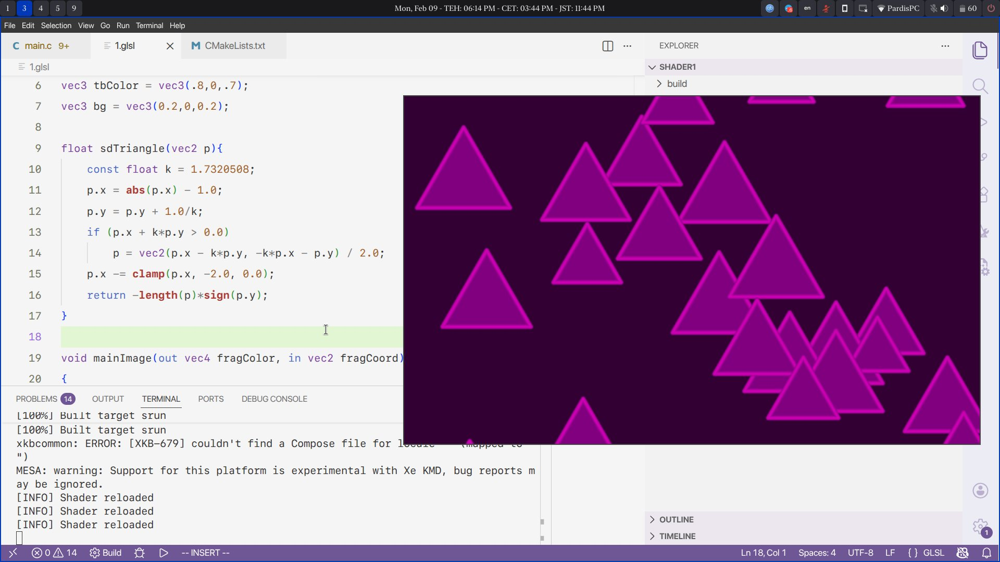

# ShaderRun



### Build:
```sh
git clone --recursive https://github.com/navidmafi/shaderrun

cd shaderrun

#---
# Windows 
cmake --preset mingw
cmake --build --preset mingw

# Linux
cmake --preset linux
cmake --build --preset linux
#---

# Run the included demo

./build/linux/srun demo.frag

```
